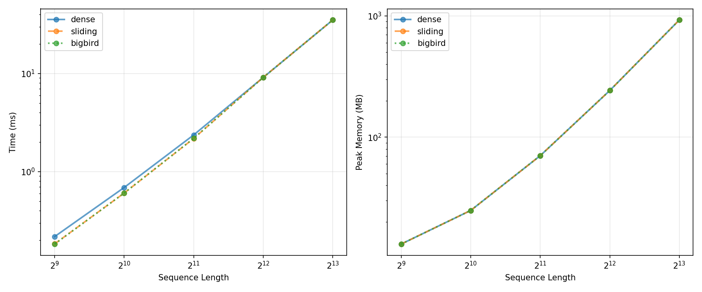

# Sparse Attention from Scratch

A minimal GPT-style transformer built from scratch and extended with sparse attention variants. The baseline follows Karpathy's Zero to Hero series; the sparse extensions explore how different attention patterns affect quality, compute, and memory trade-offs on TinyShakespeare.

## Motivation

Standard dense attention scales as O(n²) with sequence length. This project implements two sparse alternatives — sliding-window and BigBird-style (sliding + global + random) — and compares them against the dense baseline in terms of training quality, inference latency, and memory usage.

## Current state

* [x] Working dense transformer (val loss 1.5674 at 5000 iterations, n_layer=2)
* [x] Sliding-window attention (val loss 1.5646)
* [x] BigBird-style attention (val loss 1.5490)
* [x] Correctness harness (8 tests, all pass)
* [x] Numerical stability handling for fully masked rows
* [x] Benchmark: dense vs. sparse across sequence lengths (512 → 8192)
* [x] Quality comparison on TinyShakespeare
* [x] Writeup (see [writeup.md](writeup.md))
* [ ] Custom sparse attention kernel

## Architecture

The project follows a minimal GPT-style decoder-only Transformer, with the attention mechanism replaced by different attention patterns for comparison.

```text
Input tokens
     │
     ▼
Token Embedding + Positional Embedding
     │
     ▼
┌──────────────────────────────┐
│     Transformer Block × N    │
│                              │
│  LayerNorm                   │
│      │                       │
│      ▼                       │
│  Attention                  │
│      │                       │
│      ├── Dense               │
│      ├── Sliding Window     │
│      └── BigBird-style      │
│                              │
│      ▼                       │
│  Residual Connection        │
│      │                       │
│  LayerNorm                   │
│      │                       │
│      ▼                       │
│  Feed-Forward Network       │
│      │                       │
│  Residual Connection        │
└──────────────┬───────────────┘
               │
               ▼
        Language Model Head
               │
               ▼
        Next-token logits
```

## Results

### Benchmark: forward-pass time and memory vs. sequence length



| Variant | Seq 512 | Seq 1024 | Seq 2048 | Seq 4096 | Seq 8192 |
| ------- | ------- | -------- | -------- | -------- | -------- |
| Dense   | 0.22 ms | 0.69 ms  | 2.37 ms  | 9.13 ms  | 35.15 ms |
| Sliding | 0.18 ms | 0.60 ms  | 2.18 ms  | 9.14 ms  | 35.18 ms |
| BigBird | 0.18 ms | 0.61 ms  | 2.19 ms  | 9.13 ms  | 35.16 ms |

Peak memory is identical across all three variants at each sequence length (13.2 MB → 924.4 MB).

**Finding:** Naive mask-based sparse attention exhibits essentially the same time and memory scaling as dense attention (O(n²)). This is expected: `masked_fill` masks entries in an already-allocated T×T score matrix, so the underlying quadratic computation and memory allocation remain unchanged. Real computationally sparse attention avoids materializing the full attention matrix, typically through specialized sparse/block-sparse implementations or kernels; implementing such a kernel is beyond the current scope.

Hardware: RTX 3050 6GB, batch size 1, single attention head.

### Quality comparison on TinyShakespeare

Trained with matched hyperparameters (`block_size=256`, `n_layer=2`, `n_head=6`, `batch_size=64`, 5000 iterations).

| Variant | Config                         | Val Loss |
| ------- | ------------------------------ | -------- |
| Dense   | full causal                    | 1.5674   |
| Sliding | window_size=128                | 1.5646   |
| BigBird | window=128, global=2, random=3 | 1.5490   |

BigBird achieves the lowest validation loss in this run. The difference is small, and further runs with multiple random seeds would be needed to determine whether the observed gap is statistically consistent. See [writeup.md](writeup.md) for full discussion.

Generation samples from each trained model: [samples.txt](samples.txt).

## Setup

Prerequisites: PyTorch (CUDA optional but recommended), Python 3.10+, matplotlib.

Training a model:

```bash
conda activate ml
python nano.py
```

Configure the attention type in `hyperparams.py` by setting `mask_type` to `'dense'`, `'sliding'`, or `'bigbird'`.

Running the correctness harness:

```bash
python harness.py
```

This will produce `benchmark_results.csv` and `assets/benchmark_plot.png`.

## References

[1] Vaswani et al. (2017). *Attention Is All You Need*. NeurIPS.

[2] Beltagy, Peters, & Cohan (2020). *Longformer: The Long-Document Transformer*. arXiv:2004.05150.

[3] Zaheer et al. (2020). *Big Bird: Transformers for Longer Sequences*. NeurIPS.

[4] Dao et al. (2022). *FlashAttention*. NeurIPS.
